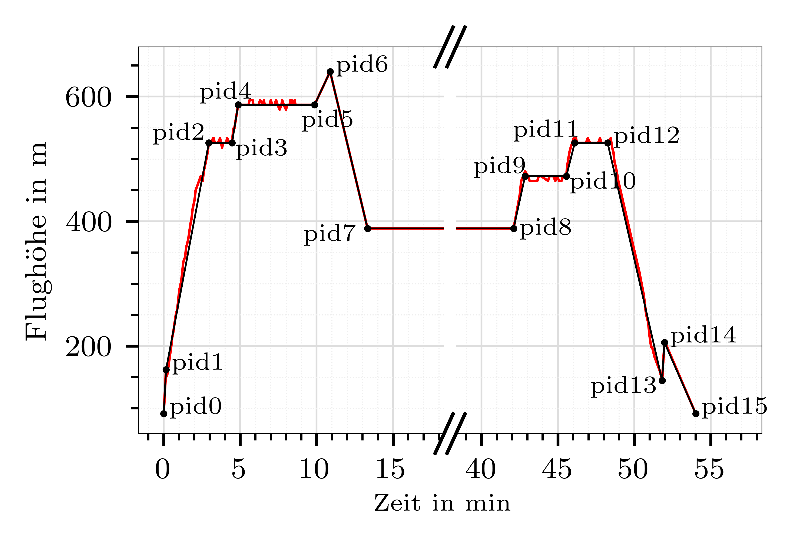

# Lärmabschätzung einer elektrischen Maschine für einen parallel-hybriden Antriebsstrang eines Helikopters

[Sebastian Hakansson](mailto:sebastian.hakansson@dlr.de), [Erik W. Schneehagen](mailto:erik.schneehagen@dlr.de), [Thomas F. Geyer](mailto:thomas.geyer@dlr.de)

## DAGA 2026 Poster Beitrag - Abstract
Der Luftfahrtsektor befindet sich derzeit in einer Phase der Elektrifizierung von Antriebssystemen. Das Ziel ist die Reduktion von schadstoffhaltigen Abgasemissionen, die Verringerung der Lärmbelastung sowie die Erschließung neuer Mobilitätskonzepte. Diese Entwicklung ist sowohl bei Starr- als auch bei Drehflüglern zu beobachten. Deutlich wird dies durch die Vielzahl an Konzepten für eVTOLs im Rahmen der urbanen Mobilität. Auch die Elektrifizierung der Antriebsstränge größerer Hubschrauber rückt zunehmend in den Fokus.
Viele der Konzeptstudien zur Elektrifizierung von Luftfahrtantrieben im Allgemeinen konzentrieren sich auf zu verwendende oder zu entwickelnde Topologien und Architekturen, die resultierende Leistung und Effizienz sowie auf mögliche Missionsprofile. Elektrische Maschinen erzeugen jedoch Geräusche. Mit zunehmender Elektrifizierung gewinnen diese Geräuschquellen an Bedeutung und müssen bereits früh im Entwurfsprozess berücksichtigt werden.
Für einen leichten, zweimotorigen Mehrzweck-Hubschrauber wurde mit Hilfe eines Open-Source-Vorentwurfs-Tools eine elektrische Maschine entworfen und anschließend ihre abgestrahlte Schallleistung berechnet. Dabei wird für jede Gasturbine eine elektrische Maschine vorgesehen, um das Triebwerk in definierten Flugphasen zu unterstützen. Unter Verwendung einer Modalanalyse zur Bestimmung von Eigenfrequenzen/-formen wurde die äquivalent abgestrahlte Schallleistung auf Basis der im Luftspalt der elektrischen Maschine wirkenden Kräfte ermittelt. In einem weiteren Schritt wurde die abgestrahlte Schallleistung, Schalldruckpegel sowie die Richtcharakteristik der Maschine unter Verwendung einer Fluid-Struktur-Kopplung bestimmt sowie diskutiert.

## Literatur
* Hakansson, S. and Schulze, P. and Burgmayer R. and Schneehagen E. W. and Geyer, T. F. (2025). "Numerical investigation of the noise generation of electric motors in urban air mobility vehicles.". J. Acoust. Soc. Am., 158 (4): pp. 2647–2658. https://doi.org/10.1121/10.0039427
* Bolvashenkov, I. and Kammermann, J. and Wenbin, Z. and Frenkel, I. and Herzog, H.-G. (2020). "Comparative Reliability Analysis of Different Traction Drive Topologies for a Search-and-Rescue Helicopter". Stochastic Models In Reliability Engineering, pp. 331-354.
* Donateo, T. and Carlà, A. and Avanzini, G. (2018). "Fuel consumption of rotorcrafts and potentiality for hybrid electric power systems". Energy Conversion and Management, vol. 164, pp. 429-442. https://doi.org/10.1016/j.enconman.2018.03.016
* "Flight tracking using AirNav Radar". Accessed: 2024-07-30. https://www.airnavradar.com/
* Seddon, J. M. and Newman, S. (2001). "Basic Helicopter Aerodynamics, Second Edition". Blackwell Science Ltd.
* Kalt, S. and Erhard, J. and Lienkamp, M. (2020). "Electric machine design tool for permanent magnet synchronous machines and induction machines". Machines, vol. 8, no. 1, p. 15. https://doi.org/10.3390/machines8010015
* Hakansson, S. and Geyer, F. T. (2024). "Untersuchung der Schallentstehung und -abstrahlung elektrischer Maschinen für neuartige elektrifizierte Luftfahrtantriebe". 50. Jahrestagung für Akustik - DAGA 2024, pp. 569-572. https://elib.dlr.de/204144/
* Hakansson, S. (2025). "Noise estimation of an electric machine for a parallel hybrid helicopter propulsion system". Proceedings of ERF 2025. https://elib.dlr.de/217538/

## Diagramme

